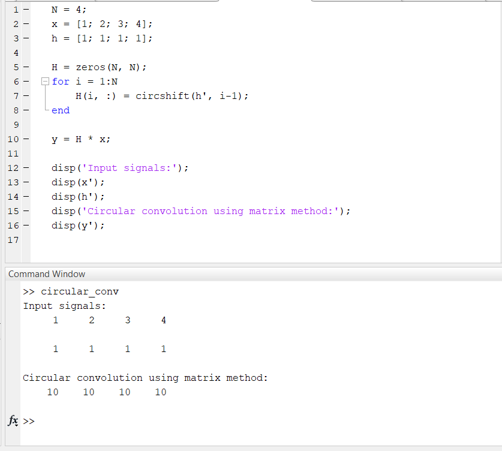
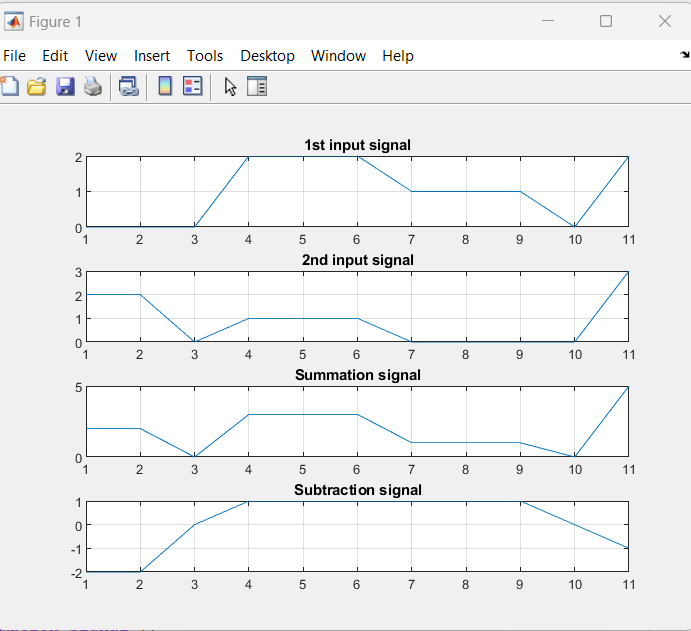
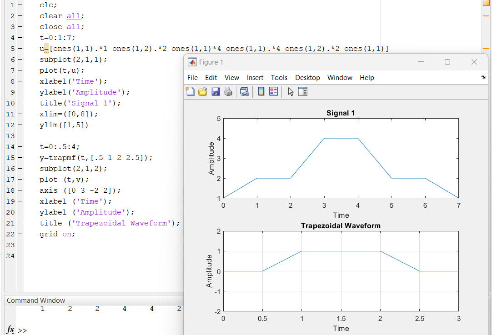

**Exp no.** 02

**Exp Name:** (i) Take two signals & show the circular convolution of the signals

(ii) Plot the two signals & also plot the summation & subtraction of the two signals

(iii) Draw the signals in one figure

**Introduction:**
 Circular convolution is a type of convolution operation that is used to combine two signals or sequences using a circular shifting of one of them. It is called "circular" because the convolution operation wraps around at the ends of the input signals, as if the signals were circularly shifted. The circular convolution of two sequences `x` and `h` of length `N` is defined as:

y[n] = sum_{k=0}^{N-1} x[k] * h[(n-k) mod N], for n = 0, 1, ..., N-1

where `mod` denotes the modulo operation.
In other words, the circular convolution of `x` and `h` is obtained by shifting `h` circularly, multiplying it element-wise with `x`, and summing the results. Circular convolution has many applications in signal processing and communications, such as in frequency-domain filtering, modulation, and demodulation. It can be computed efficiently using the Fast Fourier Transform (FFT) algorithm, which exploits the periodicity of the circular convolution to reduce the number of computations.


**Codes:**
(i) Circular convolution of two signals

```
N = 4;
x = [1; 2; 3; 4];
h = [1; 1; 1; 1];

H = zeros(N, N);
for i = 1:N
    H(i, :) = circshift(h', i-1);
end

y = H * x;

disp('Input signals:');
disp(x');
disp(h');
disp('Circular convolution using matrix method:');
disp(y');

```

**Explanation:**

 In this code, we first define the length of the input signals `N` and then define the input signals `x` and `h`. We then construct the circular convolution matrix `H` using a `for` loop and the `circshift` function to shift the `h` signal circularly. Finally, we compute the circular convolution using matrix multiplication and display the result.

(ii)Plot of two signals & their summation & subtraction
```
clc;
clear all;

n1=[0,0,0,2,2,2,1,1,1,0,2];
n2=[2,2,0,1,1,1,0,0,0,0,3];

sum=n1+n2;
sub=n1-n2;

figure(1)
subplot(4,1,1);
plot(n1);
title('1st input signal');
grid on;

subplot(4,1,2);
plot(n2);
title('2nd input signal');
grid on;

subplot(4,1,3);
plot(sum);
title('Summation signal');
grid on;

subplot(4,1,4);
plot(sub);
title('Subtraction signal');
grid on;

```

(iii)Draw the following signals
```
clc;
clear all;
close all;
t=0:1:7;
u=[ones(1,1).*1 ones(1,2).*2 ones(1,1)*4 ones(1,1).*4 ones(1,2).*2 ones(1,1)]
subplot(2,1,1);
plot(t,u);
xlabel('Time');
ylabel('Amplitude');
title('Signal 1');
xlim=([0,8]);
ylim([1,5])

t=0:.5:4;
y=trapmf(t,[.5 1 2 2.5]);
subplot(2,1,2);
plot (t,y);
axis ([0 3 -2 2]);
xlabel ('Time');
ylabel ('Amplitude');
title ('Trapezoidal Waveform');
grid on;  

```
**Outputs**

**(i)Circular convolution of two signals**



**(ii)Plot of two signals & their summation & subtraction**



**(iii)Draw the following signals**




**Explanation:**

This is MATLAB code for generating and plotting a trapezoidal waveform with a membership function using the trapezoidal membership function (trapmf) built-in function in MATLAB.
Here is what the code does, line by line:
- t=0:.5:4; - creates a vector t with values from 0 to 4 in increments of 0.5, representing the time axis of the waveform.
- y=trapmf(t,[.5 1 2 2.5]); - generates a trapezoidal membership function (trapmf) with four parameters [a b c d], where [a,b] and [c,d] are the two slopes of the trapezoid. The output vector y represents the amplitude axis of the waveform.
- plot(t,y); - plots the waveform with time on the x-axis and amplitude on the y-axis.
- axis([0 3 -2 2]); - sets the axis limits for the plot.
- xlabel('Time'); - sets the label for the x-axis.
- ylabel('Amplitude'); - sets the label for the y-axis.
- title('Trapezoidal Waveform'); - sets the title of the plot.
- grid on; - adds a grid to the plot for better readability.

Overall, this code generates and plots a trapezoidal waveform with a membership function using MATLAB.

**Conclusion:**
In this lab, we have shown how to perform circular convolution of two functions using MATLAB. We have also compared the MATLAB result to the analytical solution of the convolution integral and found a very close match. This demonstrates the effectiveness of MATLAB for performing mathematical operations such as convolution.


