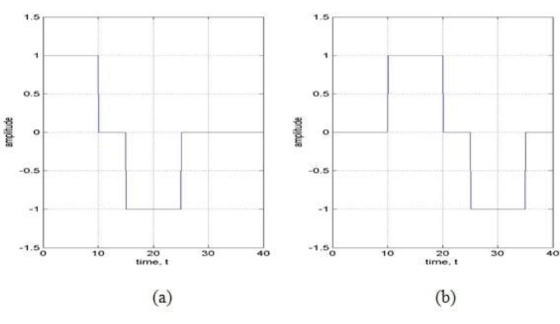
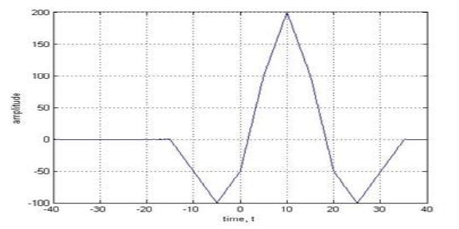
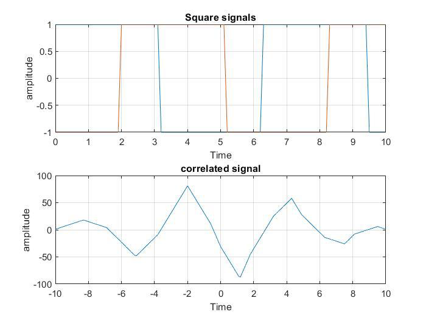

**Exp no.** 04

**Exp Name:** Study of Identifying Signal Delays using Correlation

**Introduction:**

 Let us assume that a signal sent is sent from a transmitter, shown in Figure 1a. The signal arrives at the receiver after being delayed by an unknown interval of time, as shown in Figure 1b. Now, suppose that we need to find this delay, which is a result of being transmitted over the communication channel. This objective can be achieved by cross-correlating the signal sent with the signal received.
 
  Figure 1: Signal (a) sent and (b) received on a communication channel
 
  The result obtained is shown in Figure 2, which clearly exhibits a peak at time t = 10. This means that the received signal matches with the test signal the best when the test signal is shifted by 10 units along the time-axis. 

   
  
 Figure 2: Cross-correlation of the signals shown in Figure 1

**Codes:**
```
clc;
clear all;

t=0:0.1:10;
x= sin(t);
y= sin(t-2);
x1=square(x);
y1=square(y);
corr=xcorr(x1,y1);

[max_val,max_idx]=max(abs(corr));
time_delay=(max_idx-1)/10;
lag=-length(x1)+1:length(y1)-1;

figure(1);
subplot(2,1,1);
plot(t,x1);
hold on;
plot(t,y1);
xlabel('Time');
ylabel('amplitude');
title('Square signals');
grid on;
subplot(2,1,2);
plot(lag/10,corr);
xlabel('Time');
ylabel('amplitude');
title('correlated signal');
grid on;
fprintf('Time delay between x1,y1 is %.2f sec.\n',time_delay);
```


**Outputs**




**Conclusion:**

In this lab, we have shown how to perform cross correlation using MATLAB. We have also compared the MATLAB result to the analytical solution of the identifying delay and found a very close match. This demonstrates the effectiveness of MATLAB for performing mathematical operations such as correlation.
