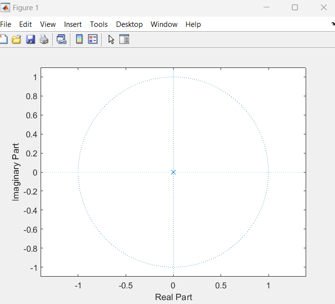
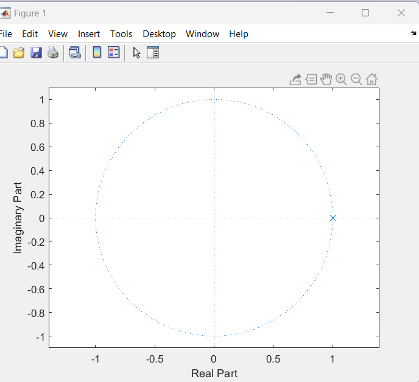
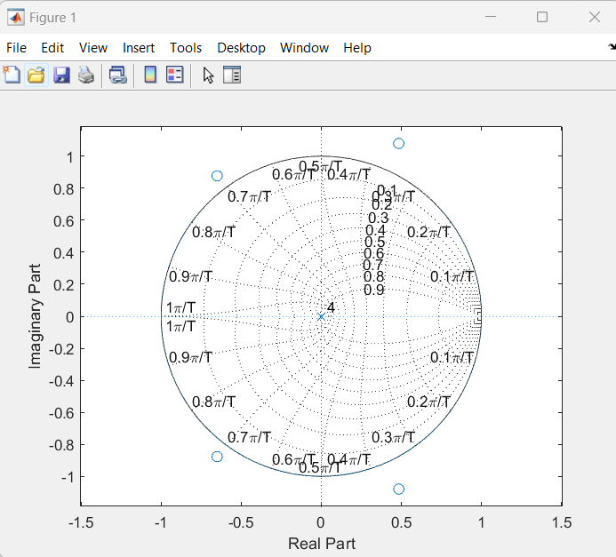
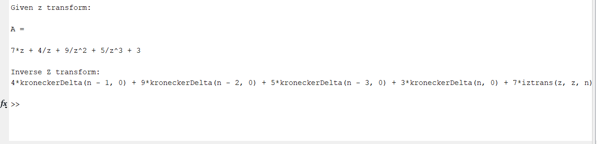

**Exp no.** 05

**Exp Name:** (i) Study of Causal Signal,

(ii) Study of non-causal signal,

(iii) Study of anti-causal signal,

(iv) Study of inverse Z-transform

**Theory:**

**(i) Causal Signal:**

A continuous time signal 𝑥(𝑡) is called causal signal if the signal 𝑥(𝑡) = 0 for 𝑡 < 0. Therefore, a causal signal does not exist for negative time. The unit step signal u(t) is an example of causal signal 

**(ii)Non-Causal Signal:**

A continuous-time signal x(t) is called the anti-causal signal if x(t) = 0 for t > 0. Hence, an anti-causal signal does not exist for positive time. The time reversed unit step signal u(-t) is an example of anti-causal signal 

**(iii)Anti-Causal Signal**

A signal which is not causal is called the non-causal signal. Hence, by the definition, a signal that exists for positive as well as negative time is neither causal nor anti-causal, it is non-causal signal. The sine and cosine signals are examples of non-causal signal.

**(iv)Inverse Z-transform**

The inverse z-transform is a mathematical operation that converts a function or expression in the z-domain back into the time-domain. It is the counterpart of the z-transform, which is a widely used tool in the analysis and design of discrete-time systems.

The inverse z-transform is denoted as Z^-1 and is used to find the corresponding discrete-time function from a given z-transformed representation. The z-transform converts a discrete-time signal into a complex variable, while the inverse z-transform performs the reverse operation.


**Codes:**
(i) Causal Signal
```
clc;
clear all;
disp('The causal signal: ');
x = [3,1,4,2,5]
l = length(x);

A=0;
z=sym('z');

for i=0: l-1
    A=A+x(i+1).*z^(-i);
end
disp('Z transform: ')
disp(A);

z=[];
p=[0];
zplane(z,p);
```
(ii)Anti-Causal Signal
```
clc;
clear all;
disp('The anti-causal signal: ');
x = [3,1,4,2,5]
x=fliplr(x);
l = length(x);

A=0;
z=sym('z');

for i=0: l-1
    A=A+x(i+1).*z^(i);
end
disp('Z transform: ')
disp(A);
z=[];
p=[1];
zplane(z,p);
```
(iii) Non-Causal Signal:
```
clc;
clear all;
disp('The non-causal signal: ');
x = [3,1,4,2,5]
l = length(x);
n = input('Zero index: ');

A=0;
z=sym('z');

for i=0: l-1
    A=A+x(i+1).*z^(-i+n-1);
end
disp('Z transform: ')
disp(A);

transfer=tf(x,1);
zplane(x,1);
zgrid;
```
(iv)Inverse Z-transform
```
clc;
clear all;

z=sym('z');
disp('Given z transform: ');
A = 7*z + 4/z + 9/z^2 + 5/z^3 + 3

syms z
f=iztrans(A);
disp('Inverse Z transform:');
disp(f);
```
**Outputs**

**(i)Causal Signal**



**(ii)Anti-Causal Signal**



**(iii)Non-Causal Signal**



**(iv)Inverse Z-transform**



**Conclusion:**

In this lab, we have shown how to plot ROC of causal signal, non-causal signal, anti-causal signal & inverse z-transform using MATLAB. We have also compared the MATLAB result to the analytical solution and found a very close match. This demonstrates the effectiveness of MATLAB for performing mathematical operations.


